# TerraRun

A small Node.js service running on **Cloud Run** behind a global HTTPS load balancer, with everything wired up via **Terraform** and deployed through **GitHub Actions**.

I built this as a hands-on way to learn GCP after spending most of my time on AWS — the brief said "deploy a containerised app on Cloud Run behind a real domain, do it with IaC, automate it" and this is the result.

Live at **https://cr.saram-khan.site**.

---

## What it does

- `GET /` → a small dark-themed landing page (revision, region, the stack used)
- `GET /health` → `{"status":"ok"}` — the LB and Cloud Run startup/liveness probes hit this
- `GET /api/info` → service metadata as JSON
- `GET /api/time` → current server time

Nothing fancy on the app side — the interesting bits are the infrastructure.

---

## Architecture

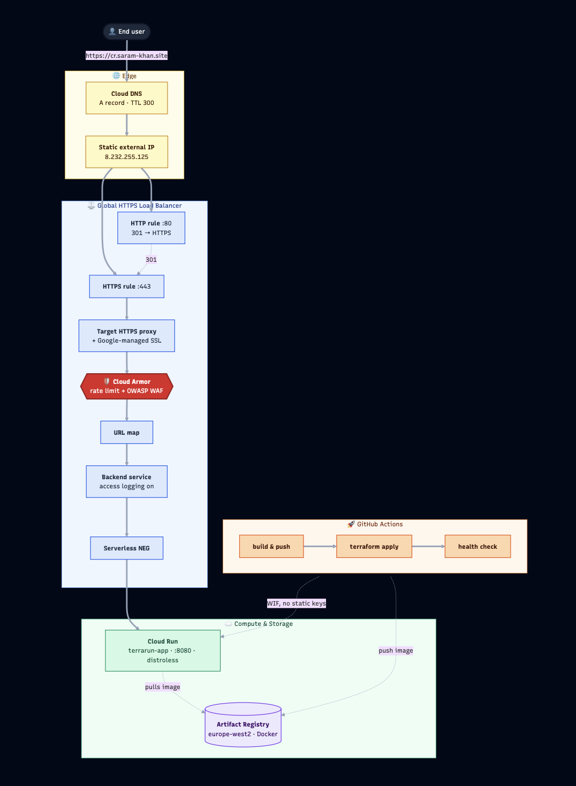

### AWS → GCP mapping (for my own reference)

I came from AWS so this is the lookup table I kept open:

| AWS | GCP |
|---|---|
| ECS Fargate | Cloud Run |
| ECR | Artifact Registry |
| Application LB | Global HTTPS LB + Serverless NEG |
| ACM | Google-managed SSL Cert |
| Route 53 | Cloud DNS |
| IAM Roles | IAM + Workload Identity Federation |
| CloudFormation | Terraform (always) |

---

## Repo layout

```
.
├── app/                    # Node.js + Express service
│   ├── src/index.js        # / (HTML), /health, /api/info, /api/time
│   ├── src/landing.html    # the dark landing page
│   ├── test/health.test.js
│   └── package.json
├── Dockerfile              # multi-stage, distroless, non-root, listens on :8080
├── .dockerignore
├── infra/                  # Terraform
│   ├── provider.tf
│   ├── backend.tf          # GCS remote state
│   ├── variables.tf
│   ├── main.tf             # wires the modules together
│   ├── outputs.tf
│   ├── terraform.tfvars.example
│   └── modules/
│       ├── artifact-registry/
│       ├── cloud-run/      # service + runtime SA + invoker IAM
│       ├── load-balancer/  # NEG, backend, URL map, HTTPS proxy, managed cert, static IP, HTTP→HTTPS redirect
│       └── dns/            # A record in an existing zone
└── .github/workflows/
    ├── build-and-push.yml  # docker build + push to AR (workflow_dispatch + workflow_call)
    ├── terraform.yml       # fmt/validate/tflint, plan on PR, apply on main
    └── deploy.yml          # orchestrates build → apply → smoke test
```

**Why no separate `ssl/` module?** The brief's example layout shows one, but the Google-managed SSL cert is bound directly to the `target_https_proxy` and only ever consumed by the load balancer. Splitting it out creates a dependency loop for no real benefit, so the cert lives inside the `load-balancer` module.

---

## Running it locally

```bash
cd app
npm install
npm start
# in another shell
curl http://localhost:8080/health
# {"status":"ok"}
```

Tests:

```bash
cd app && npm test
```

### As a container

```bash
docker build -t terrarun-app .
docker run --rm -p 8080:8080 terrarun-app
curl http://localhost:8080/health
```

The image is multi-stage and runs on `gcr.io/distroless/nodejs20-debian12:nonroot`. No shell, no package manager in the runtime image — just node + your code as a non-root user.

---

## How I built it (the order)

### 1. ClickOps first

The brief specifically asks you to do this in the console before touching Terraform, and I'm glad I did — it forces you to actually understand which GCP resources exist and how they connect. Walk-through I followed:

1. **Artifact Registry** → create a Docker repository in `europe-west2`, push an image to it via:
   ```bash
   gcloud auth configure-docker europe-west2-docker.pkg.dev
   docker tag terrarun-app europe-west2-docker.pkg.dev/$PROJECT_ID/terrarun-app/terrarun-app:v1
   docker push       europe-west2-docker.pkg.dev/$PROJECT_ID/terrarun-app/terrarun-app:v1
   ```
2. **Cloud Run** → create a service from the image, region `europe-west2`, allow unauthenticated invocations for the first test.
3. **VPC → External IP addresses** → reserve a global static IPv4 — the LB needs this.
4. **Network services → Load balancing** → HTTP(S) LB → From Internet → Global external Application LB. Frontend: HTTPS on the static IP with a Google-managed cert for the domain. Backend: a serverless NEG pointing at the Cloud Run service.
5. **Cloud DNS** → add an `A` record `cr.<your-domain>` → static IP.
6. Wait ~15–60 min for the managed cert to flip to `ACTIVE`, then `curl https://cr.<your-domain>/health`.
7. **Tear it all down in reverse order.**

The point of doing this manually was so that when I read the Terraform later, I knew exactly what each `google_compute_*` resource was for.

### 2. Then Terraform

#### One-time bootstrap (the bits Terraform can't do for you)

```bash
export PROJECT_ID=your-gcp-project-id
export REGION=europe-west2

# 1. Remote state bucket
gcloud storage buckets create gs://${PROJECT_ID}-tfstate \
  --location=${REGION} --uniform-bucket-level-access
gcloud storage buckets update gs://${PROJECT_ID}-tfstate --versioning

# 2. Cloud DNS managed zone for your subdomain
# In my case I delegated cr.saram-khan.site from Route 53 to Cloud DNS so
# nothing else on saram-khan.site was disturbed.
gcloud dns managed-zones create cr-saram-khan-site \
  --dns-name=cr.saram-khan.site. --description="TerraRun subdomain"

# Take the 4 nameservers it prints and create an NS record in your
# parent zone (mine was Route 53) for the subdomain. That delegates
# cr.* to Google without touching the apex.
```

#### Plan & apply

```bash
cd infra
cp terraform.tfvars.example terraform.tfvars
# edit: project_id, domain_name, dns_zone_name

terraform init -backend-config="bucket=${PROJECT_ID}-tfstate"
terraform plan
terraform apply
```

The first apply uses Google's placeholder `hello` image so the LB + cert can come up before any of your own images exist. CI replaces it on the next deploy.

#### What you end up with

* `https://cr.<your-domain>` → 200 on `/health`
* Port 80 → 301 to HTTPS
* Cloud Run ingress restricted to `INGRESS_TRAFFIC_INTERNAL_LOAD_BALANCER` — the direct `*.run.app` URL is **not** reachable from the internet, you can only get in via the LB
* A dedicated runtime service account (the default compute SA is never used)

### 3. CI/CD

Three GitHub Actions workflows, kept separate so each can run on its own:

| Workflow | Triggers | Does |
|---|---|---|
| `build-and-push.yml` | push to `main` under `app/`/`Dockerfile`, `workflow_dispatch`, `workflow_call` | install + test, auth to GCP via WIF, build the image, push it to Artifact Registry, output the full image ref |
| `terraform.yml` | PR (plan + comment), push to `main` (apply), `workflow_dispatch`, `workflow_call` | `fmt -check`, `validate`, `tflint`, then plan or apply against the GCS backend |
| `deploy.yml` | push to `main` under `app/`/`Dockerfile`, `workflow_dispatch` | reuses the two above and then smoke-tests `https://${DOMAIN}/health` |

**No long-lived service-account JSON keys anywhere.** Auth between GitHub Actions and GCP is done via OIDC + Workload Identity Federation.

#### Required GitHub repo Variables

Set under **Settings → Secrets and variables → Actions → Variables**:

| Name | Example |
|---|---|
| `GCP_PROJECT_ID` | `terrarun-499611` |
| `GCP_REGION` | `europe-west2` |
| `SERVICE_NAME` | `terrarun-app` |
| `AR_REPO` | `terrarun-app` |
| `DOMAIN_NAME` | `cr.saram-khan.site` |
| `DNS_ZONE_NAME` | `cr-saram-khan-site` |
| `TF_STATE_BUCKET` | `terrarun-499611-tfstate` |
| `GCP_WIF_PROVIDER` | `projects/<project_number>/locations/global/workloadIdentityPools/github/providers/github` |
| `GCP_DEPLOYER_SA` | `terrarun-deployer@terrarun-499611.iam.gserviceaccount.com` |

#### WIF bootstrap (one-time)

```bash
PROJECT_ID=your-gcp-project-id
PROJECT_NUMBER=$(gcloud projects describe "$PROJECT_ID" --format='value(projectNumber)')
REPO=YOUR_GH_USER/TerraRun

gcloud iam service-accounts create terrarun-deployer \
  --display-name="GitHub Actions deployer"

SA=terrarun-deployer@${PROJECT_ID}.iam.gserviceaccount.com

for role in roles/run.admin roles/artifactregistry.writer roles/iam.serviceAccountUser \
            roles/compute.loadBalancerAdmin roles/compute.networkAdmin roles/compute.securityAdmin \
            roles/dns.admin roles/storage.objectAdmin roles/serviceusage.serviceUsageAdmin \
            roles/certificatemanager.editor roles/cloudbuild.builds.editor roles/browser; do
  gcloud projects add-iam-policy-binding "$PROJECT_ID" --member="serviceAccount:${SA}" --role="$role"
done

gcloud iam workload-identity-pools create github \
  --location=global --display-name="GitHub"
gcloud iam workload-identity-pools providers create-oidc github \
  --location=global --workload-identity-pool=github \
  --display-name="github-actions" \
  --issuer-uri="https://token.actions.githubusercontent.com" \
  --attribute-mapping="google.subject=assertion.sub,attribute.repository=assertion.repository" \
  --attribute-condition="assertion.repository=='${REPO}'"

gcloud iam service-accounts add-iam-policy-binding "$SA" \
  --role=roles/iam.workloadIdentityUser \
  --member="principalSet://iam.googleapis.com/projects/${PROJECT_NUMBER}/locations/global/workloadIdentityPools/github/attribute.repository/${REPO}"
```

---

## Reproducing this from scratch

1. Clone the repo. Set `PROJECT_ID`, `REGION`, `DOMAIN`, `DNS_ZONE_NAME` for your own setup.
2. Run the WIF + state bucket + DNS zone bootstrap above.
3. `cp infra/terraform.tfvars.example infra/terraform.tfvars` and edit it.
4. `cd infra && terraform init -backend-config="bucket=${PROJECT_ID}-tfstate" && terraform apply`.
5. Push to `main` — the deploy workflow builds the image, runs `terraform apply` with the new tag, and smoke-tests the live URL.

---

## Bonus: Cloud Armor

The load balancer's backend service is fronted by a Cloud Armor security policy with three rules:

| Priority | Rule | Action |
|---|---|---|
| 1000 | Rate limit — 100 req/min per IP | `rate_based_ban` for 10 min on breach |
| 1100 | OWASP CRS SQL injection (`sqli-v33-stable`) | `deny(403)` |
| 1200 | OWASP CRS XSS (`xss-v33-stable`) | `deny(403)` |
| `2147483647` | Default | `allow` |

The policy is attached automatically when `enable_cloud_armor = true` (the default). To disable, set the variable to `false` in `terraform.tfvars`. Cost is roughly $5/month base + $0.75/rule.

Smoke-test the rate limit from a terminal:

```bash
# Should return 200 for a while, then 429 as the policy bans the IP
for i in {1..200}; do
  curl -s -o /dev/null -w "%{http_code}\n" https://cr.saram-khan.site/health
done | sort | uniq -c
```

You should see mostly `200`s followed by `429`s once the per-minute threshold is crossed.

---

## Bonus: staging environment via Terraform workspaces

The same Terraform deploys to a parallel staging environment when run in a non-default workspace. The `default` workspace stays as prod — exactly what's described above. Any other workspace gets a `-<workspace>` suffix on every resource name and serves on `<workspace>.cr.saram-khan.site` instead of the apex.

How the wiring works (in `infra/main.tf`):

```hcl
locals {
  is_default_workspace = terraform.workspace == "default"
  name_suffix          = local.is_default_workspace ? "" : "-${terraform.workspace}"
  effective_service    = "${var.service_name}${local.name_suffix}"
  effective_domain     = local.is_default_workspace ? var.domain_name : "${terraform.workspace}.${var.domain_name}"
}
```

So in workspace `staging`, the service is `terrarun-app-staging`, the LB IP is `terrarun-app-staging-ip`, the SSL cert covers `staging.cr.saram-khan.site`, and the DNS A record points to a separate static IP.

### Spinning up the staging env

```bash
cd infra
terraform workspace new staging
terraform workspace select staging

# Same backend bucket, but workspace state is automatically isolated.
terraform init -backend-config="bucket=terrarun-499611-tfstate"

terraform apply \
  -var "project_id=terrarun-499611" \
  -var "region=europe-west2" \
  -var "domain_name=cr.saram-khan.site" \
  -var "dns_zone_name=cr-saram-khan-site" \
  -var "image=europe-west2-docker.pkg.dev/terrarun-499611/terrarun-app/terrarun-app:v4"
```

After ~3–5 minutes plus SSL cert provisioning time, `https://staging.cr.saram-khan.site` is live alongside prod. State files live at `gs://terrarun-499611-tfstate/terrarun/state/staging.tfstate` (vs prod's `default.tfstate`), so the environments never step on each other.

### Switching back to prod

```bash
terraform workspace select default
terraform apply ...   # touches prod again
```

### Tear down just the staging env

```bash
terraform workspace select staging
terraform destroy ...
terraform workspace select default
terraform workspace delete staging
```

Prod is untouched.

---

## Notes to my future self

- **The hardest debugging moment** was getting the SSL cert to provision. Symptom: `gcloud compute ssl-certificates describe ... --global` shows `FAILED_NOT_VISIBLE`. Almost always means the A record isn't actually resolvable from the public internet yet — either DNS hasn't propagated, or the delegation chain (parent zone → child zone) is broken. `dig cr.<domain> +trace` from a different network is the fastest way to confirm.
- **Cloud Run ingress = `INGRESS_TRAFFIC_INTERNAL_LOAD_BALANCER` is a one-way door for testing.** It blocks the `*.run.app` URL too, so if you set it before pushing through the LB you can't quickly hit Cloud Run directly to debug. Worth knowing before you panic.
- **`npm ci` requires a lockfile.** First Cloud Build run failed because I didn't have `app/package-lock.json` committed. The fix in the Dockerfile is now `npm install` with a fallback; once a lockfile exists in CI it gets used automatically.
- The Google-managed SSL cert takes anywhere from ~5 to ~60 minutes to go `ACTIVE`. In my case it was ~5 minutes — DNS propagation was fast because the Route 53 → Cloud DNS delegation TTL was 300s.

---

## Screenshots

Captured during the build-out — kept in [`docs/screenshots/`](docs/screenshots/).

### 01 — Cloud Run service
The `terrarun-app` Cloud Run service in the GCP console — revision list, ingress set to "Internal and Cloud Load Balancing", region `europe-west2`.

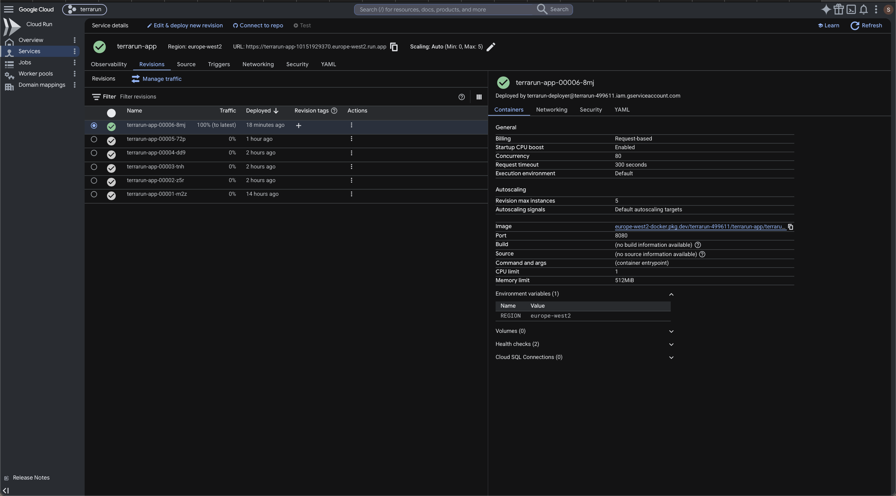

### 02 — Artifact Registry
Artifact Registry repo `terrarun-app` with the pushed image tags (`v1`–`v4`, plus the per-commit `sha-*` tags from CI).

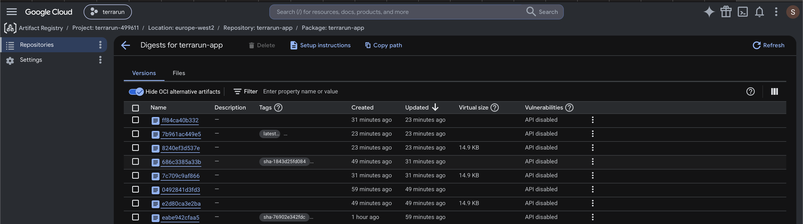

### 03 — Load balancer details
Network services → Load balancing → `terrarun-app-https` showing the static IP `8.232.255.125`, the managed SSL cert, and the serverless NEG backend.

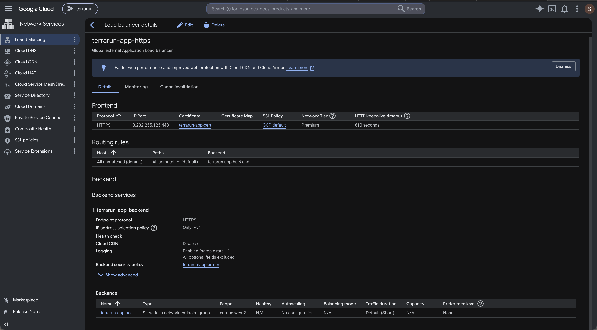

### 04 — HTTPS forwarding rule
The HTTPS forwarding rule `terrarun-app-https-fr` — static IP `8.232.255.125`, port 443, premium tier, with the Terraform labels (`app:terrarun`, `managed:terraform`).

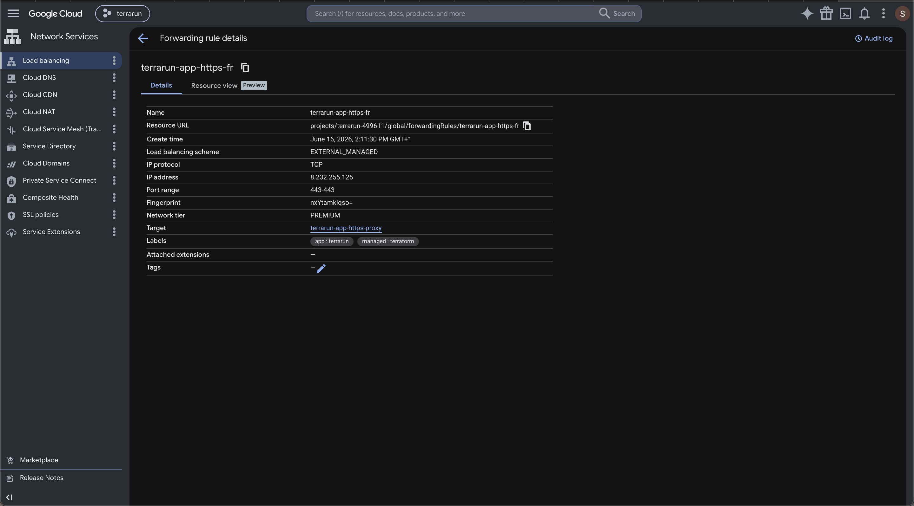

### 05 — Cloud DNS zone
Cloud DNS zone `cr-saram-khan-site` with the A record `cr.saram-khan.site → 8.232.255.125` alongside the SOA/NS records.

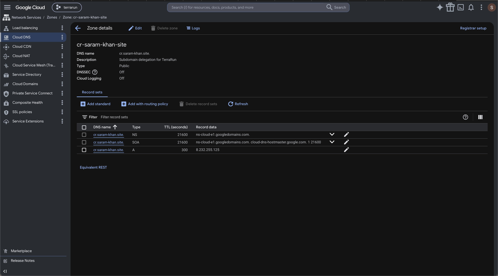

### 06 — Route 53 subdomain delegation
AWS Route 53 hosted zone `saram-khan.site` with the NS record for `cr` pointing to the four `ns-cloud-e*.googledomains.com` nameservers — the delegation that hands `cr.*` from AWS over to GCP.

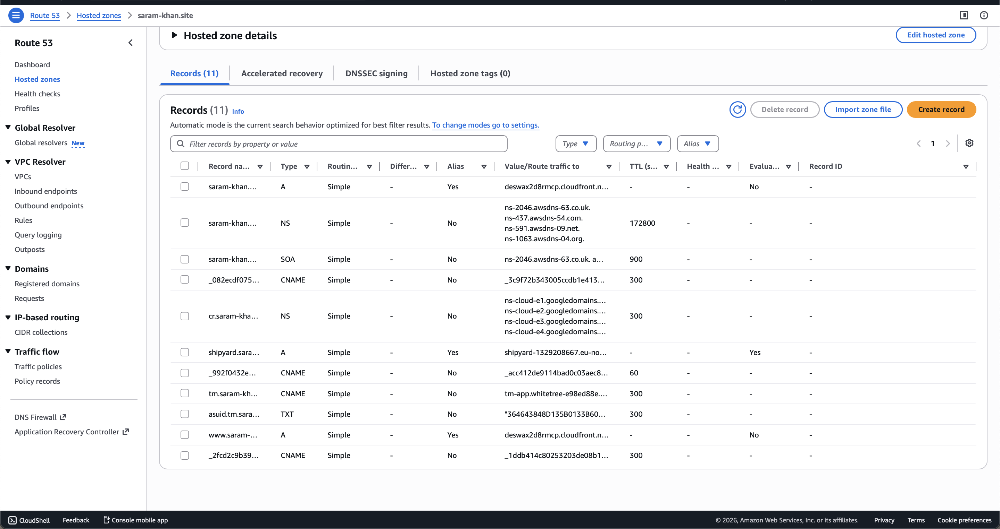

### 07 — Live site
Browser hitting `https://cr.saram-khan.site` — modern dark landing page with a "Live" status pill, animated gradient blobs in the background, the meta strip (revision / region / runtime), three feature cards for the endpoints (Heartbeat, Service info, Live clock) with hover popovers showing live mini-previews, and the "Built with" chips listing the full stack.

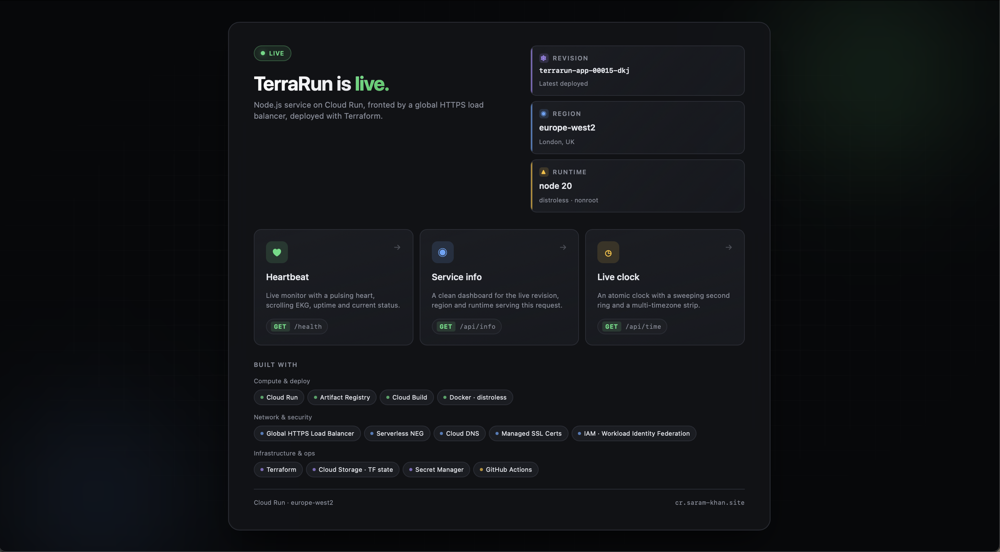

### 08 — Heartbeat (`/health`)
The `/health` page rendered as a heartbeat monitor — pulsing heart, scrolling EKG waveform, live uptime ticker, and stat tiles for revision and region. The same URL returns raw JSON (`{"status":"ok"}`) to `curl` thanks to content negotiation on the `Accept` header.

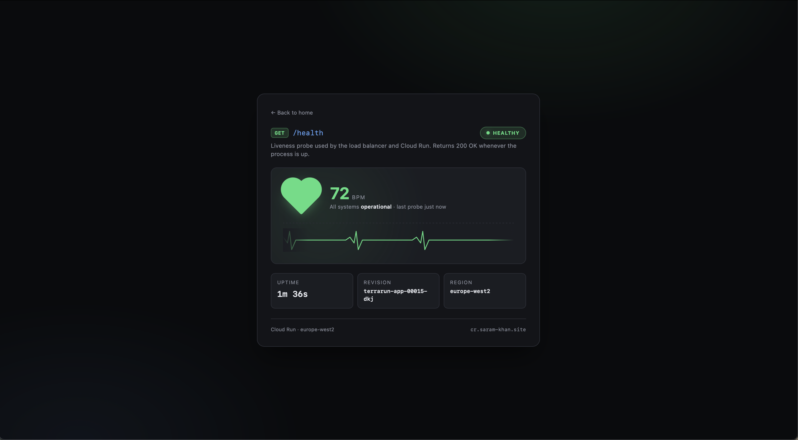

### 09 — Service info (`/api/info`)
The `/api/info` page rendered as a service dashboard — animated hero card with the service name, then three icon tiles (Revision, Region, Runtime) summarising the Cloud Run identity. Same content negotiation: `curl` still gets raw JSON.

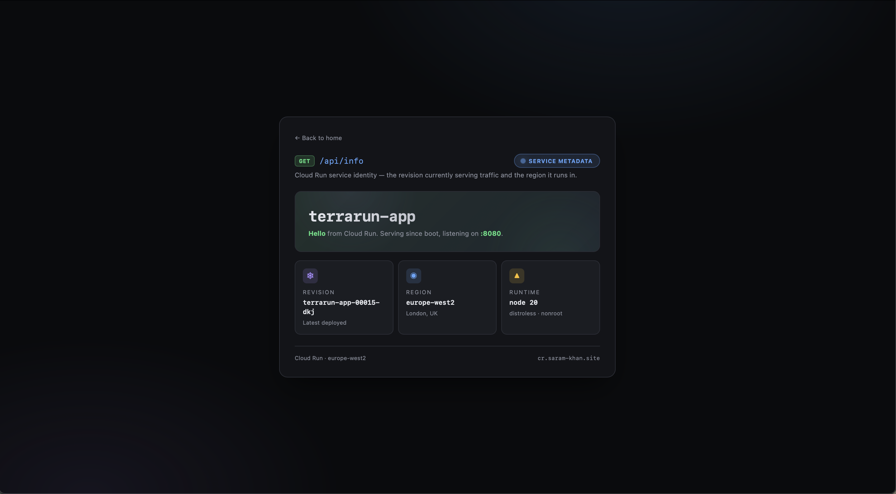

### 10 — Live clock (`/api/time`)
The `/api/time` page rendered as a live atomic clock — a 60-second progress ring that sweeps every minute, blinking colons, big digital display, and a three-column timezone strip (UTC, London, browser-local). `curl` to the same URL returns `{"now":"…ISO…"}`.

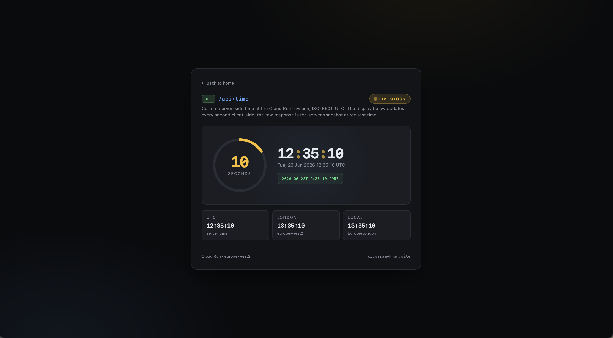

### 11 — Green CI/CD deploy
`deploy` workflow run — all four jobs green: `build` → `fmt+validate+tflint` → `apply` → `post-deploy health check`. The `deploy/plan` node is correctly skipped (plan only runs on PRs).

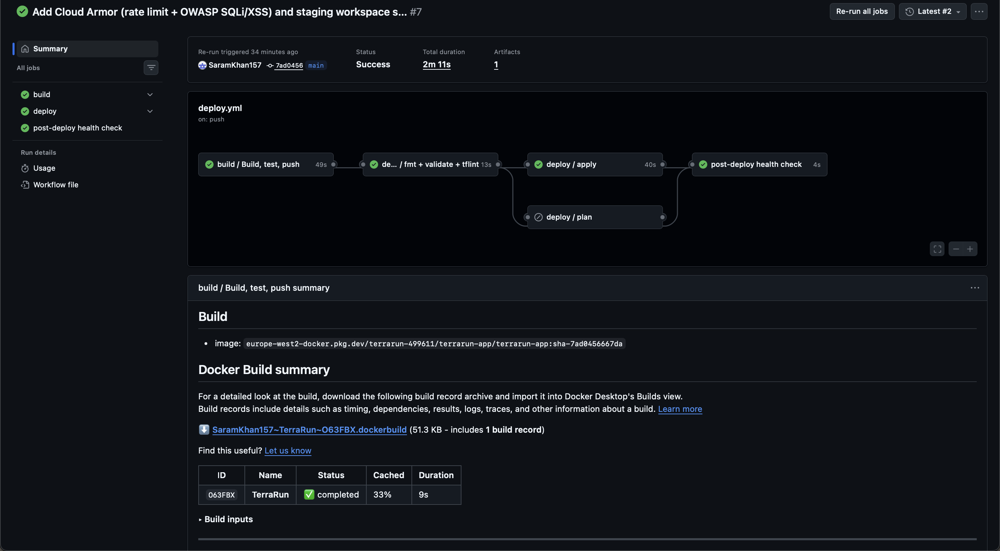

### 12 — GitHub Actions Variables
GitHub repo Settings → Actions → Variables showing the 9 repository variables that drive CI (project ID, region, WIF provider path, deployer SA, etc.).

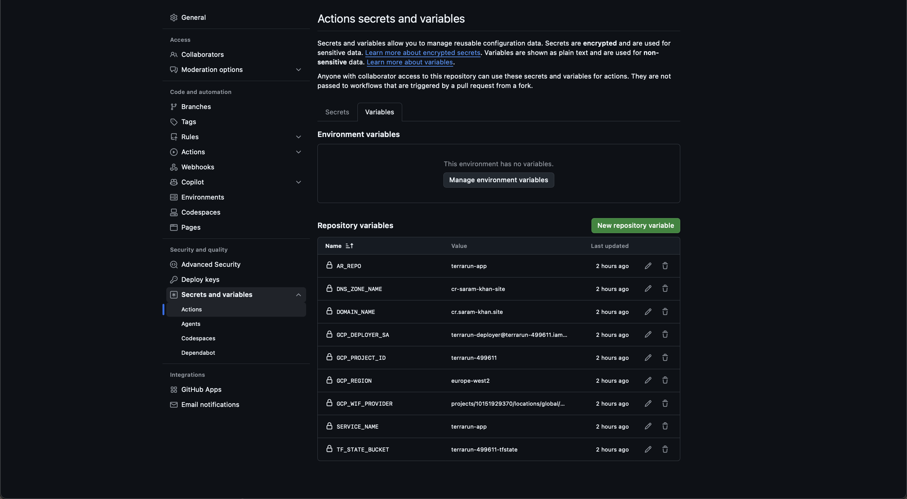

### 13 — IAM: deployer service account
GCP IAM page filtered to `terrarun-deployer@…` — the 12 least-privilege roles bound to the SA that GitHub Actions impersonates via Workload Identity Federation. No JSON keys anywhere.

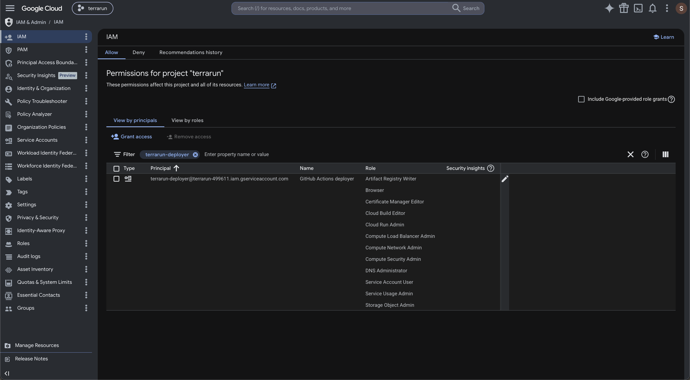
